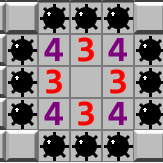

## Current Bugs:

No win condition, the amount of revealed tiles is incorrect. Usually off by 2-3.  
This looks to be in our Clicking function, need to find out why the number is inaccurate

It's an issue with the _RevealedTile++_

The issue seems to be in the functions _revealNeighborMInes()_ and _boardClick()_ in the file __board.cpp__

The issue at this point lies in when the square is surrounded by tiles that neighbor a mine like in the picture below: 

In the picture it shows only a revealed tile number of 8 instead of the expected 9
